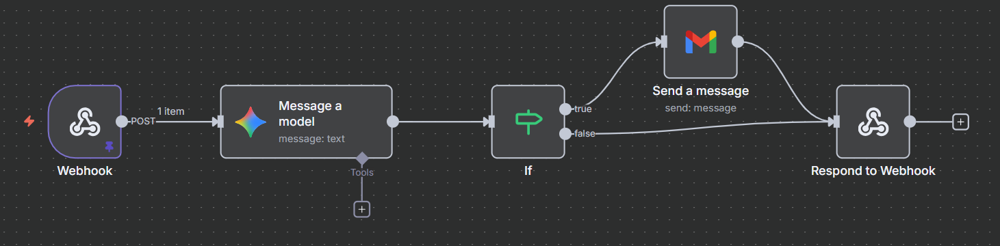

## Manager Email

**Subject:** New Property Search Protocol  
**From:** Chief Leasing Officer  
**To:** Leasing Agent – Charlottesville, VA (ZIP 22903)  
**Date:** August 24, 2025  

Good Afternoon,

Thank you for all your hard work as the head of our leasing department in Charlottesville, Virginia. Before the rush for housing begins, we need a more effective method for comparing rates with other rental properties in the area. This will allow prospective tenants to have a smoother experience when searching for their future homes!

Given the University of Virginia (UVA) community, the local housing market is already competitive, so we need this workflow completed quickly.

To accomplish this, you are responsible for building an **n8n Agent Workflow** that accepts input in the form of:

> **“X bedrooms, X bathrooms, XXXX dollars”**  
> *(representing bedroom count, bathroom count, and maximum rent)*

The goal of the workflow is to send an email (preferably via Gmail) to the user containing a list of rentals that meet the criteria listed, along with each property’s **distance to the University of Virginia’s School of Data Science** (our reference point).

### Required Workflow Components
- **Webhook** to accept the input parameters  
- **Gemini search** to gather listings and relevant information  
- **Email send** with results in **table format**  
  - If parameters are missing or unrecognizable, send an email informing the user

Good luck! We hope to see your model up and running soon as we need these listings live as soon as possible.

Thank you,  

**YS**

## Core Concepts:

What are we building? **An n8n Agent Workflow**

It is important to know what a workflow even is. A workflow is a model that completes a certain task(s) through building blocks called nodes. The model automoates these tasks through these nodes that are built off of eachother. For example, in our case, we will provide some inputs, search based on those inputs, and output something all from inputing three parameters. Think of this as a linear model, Input -> Doing something with the input -> Output. These models can be as long or as short as the task requires them to be, for our purposes, reference the model below to see the ideal representation!

## How to run:

This model will be run locally through Docker. To set up, follow these commands and make sure to have Docker installed on your machine.

Create your Docker volume

    docker volume create n8n_data

Next, lets run n8n in Docker
     
    docker run -it --rm --name n8n \
    -p 5678:5678 \
    -v n8n_data:/home/node/.n8n \
    -e N8N_SECURE_COOKIE=false
    docker.n8n.io/n8nio/n8n

You can access the n8n interface here: http://localhost:5678/

Now that we have it running, its time to start building our nodes. Our model needs to begin with a webhook node in order for it to allow an HTTP POST request. 

Select the POST HTTP Method within the node and set the "Respond" dropdown to "Using Respond to Webhook Node". Also customize the Path (ex. rent-criteria). This node acts as our entry point for the entire model, without these key components, we won't be able to build off of this node.  

The configuration of the node should look similar to this:

Now its time to call the LLM model in order to perform our search. Add another node, this time a "Message a model" node through Google Gemini. This part will require some additional API enabling.  

The ones we need for this project are Gemini's API and Gmail's API. You can enable the specific API's that are needed here: https://console.cloud.google.com/  

Secondly, to establish an AI API key, visit https://aistudio.google.com/ , head to dashboard, and configure an API key.

Make sure to configure proper credentials for when the "Message a Model" and "Gmail" nodes request valid credentials.

Once these are enabled, now you can successfully create your Google Gemini node. Make sure the selected operation is "Message a Model". The other fields are to be filled in as well based on the search that *should* be performed to accomplish the overall task of the model. The prompt being input does require some information from the Webhook node for the actual search to be generated by Gemini through the parameters the user sends. To do this, paste {{ $json.body.body }} as the user inputs in the prompt field followed by the prompt for Gemini to follow.  

Example:

    Im going to give you three inputs: Bedroom count, Bathroom count, MAX rent amount.
    HERE ARE THE INPUTS: {{ $json.body.body }}
    etc...

Once this node is complete and running, we need to make sure we get our desired output from messaging the model. This means that if we are missing input parameters, we need to be aware and the email not be sent, and if we have any necessary information and our "Message a Model" node runs smoothly, we need to be emailed the result. To do this, we need to create an IF node, and like it sounds, it uses an input to determine what to do.  

In this specific project, we first need to have Gemini output a consistent message if something goes wrong, for example "Please provide ALL inputs". Now, in the IF node, it uses Gemini's output to determine if it is suitable for an email. 

Now before we work on the email setup, we need to deal with our IF node returning false (input parameters are wrong/missing). For this, create a "Respond to Webhook" node and pass a custom **TEXT EXPRESSION**. Becuase we are basing this node off of the previous one, we need to reference the IF node using the output Gemini produces when an input parameter is missing. Paste this below into the **EXPRESSION** input box. When being tested, one of the following messages will display based on the IF node's success in sending an email or failure in receiving all inputs.

    {{ 
    $node["Message a model"].json["content"]["parts"][0]["text"].includes("Please provide")
    ? "ERROR: Please provide ALL required inputs (bedrooms, bathrooms, max rent)."
    : "SUCCESS: Email sent successfully!"
    }}

See the configuration of the node below:

As of now, the workflow should look something like this:

Lastly, we need our Gmail node to complete the process and send an email based on the search results! As with the "Message a Model" an API needs to be enabled for this and a set of credentials need to be created. Further, permissions need to be give to Gmail in order for it to authorize email sending. Just keep all of this in mind before proceeding and circling back and forth if you get errors. Fill in the relevant fields and for the actual body of the email, we simply want everything that Gemini outputs to us. And if you remember from before, that means referencing a previous node ("Message a Model"), like so:

    Here is a list of rentals that meet your search criteria:
    ---------------------------
    {{ $json.content.parts[0].text }}
    
This, if done correctly, should show all rentals given the input parameters we discussed before in a table like format as shown below (for example)

