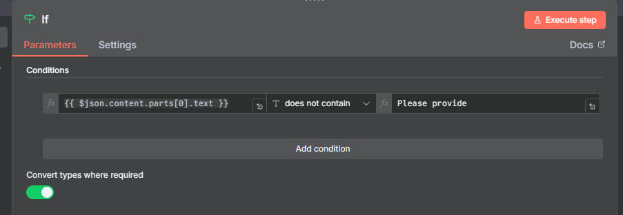
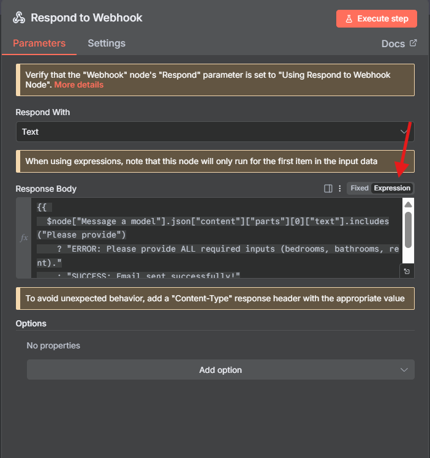
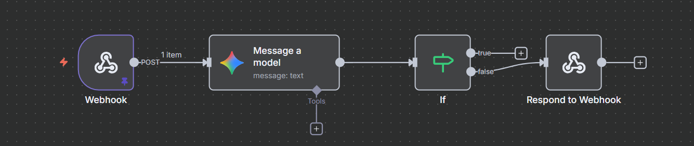
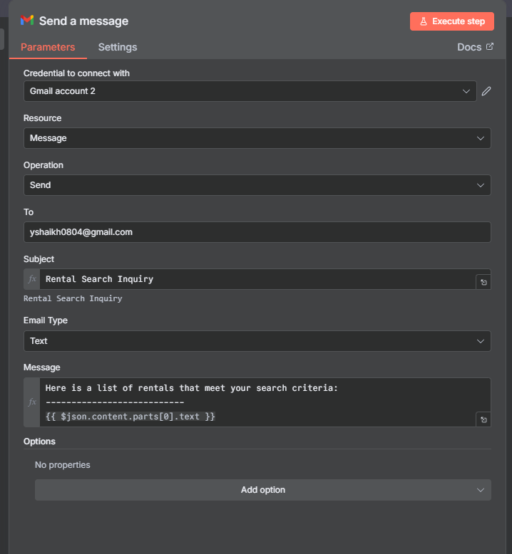
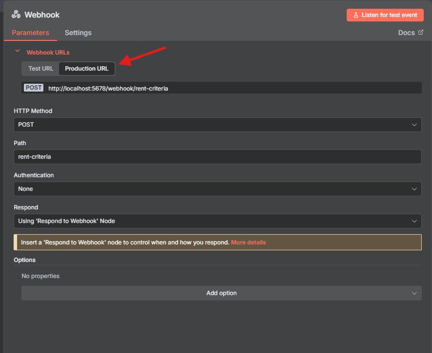
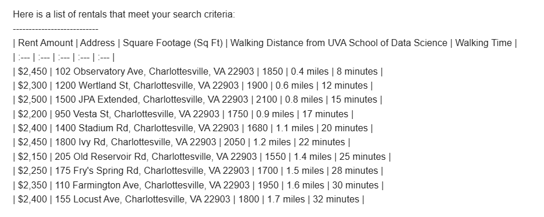
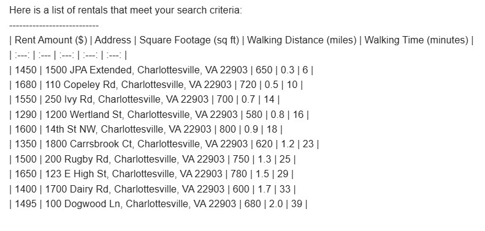
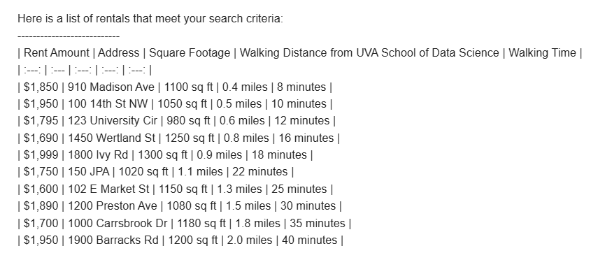

## Manager Email

**Subject:** New Property Search Protocol  
**From:** Chief Leasing Officer  
**To:** Leasing Agent – Charlottesville, VA (ZIP 22903)  
**Date:** August 24, 2025  

Good Afternoon,

Thank you for all your hard work as the head of our leasing department in Charlottesville, Virginia. Before the rush for housing begins, we need a more effective method for comparing rates with other rental properties in the area. This will allow prospective tenants to have a smoother experience when searching for their future homes!

Given the University of Virginia (UVA) community, the local housing market is already competitive, so we need this workflow completed quickly.

To accomplish this, you are responsible for building an **n8n Agent Workflow** that accepts input in the form of:

> **“X bedrooms, X bathrooms, XXXX dollars”**  
> *(representing bedroom count, bathroom count, and maximum rent)*

The goal of the workflow is to send an email (preferably via Gmail) to the user containing a list of rentals that meet the criteria listed, along with each property’s **distance to the University of Virginia’s School of Data Science** (our reference point).

### Required Workflow Components
- **Webhook** to accept the input parameters  
- **Gemini search** to gather listings and relevant information  
- **Email send** with results in **table format**  
  - If parameters are missing or unrecognizable, send an email informing the user

Good luck! We hope to see your model up and running soon as we need these listings live as soon as possible.

Thank you,  

**YS**

# 2) Core Concepts:

What are we building? **An n8n Agent Workflow**

It is important to know what a workflow even is. A workflow is a model that completes a certain task(s) through building blocks called nodes. The model automoates these tasks through these nodes that are built off of eachother. For example, in our case, we will provide some inputs, search based on those inputs, and output something all from inputing three parameters. Think of this as a linear model, Input -> Doing something with the input -> Output. These models can be as long or as short as the task requires them to be, for our purposes, reference the model below to see the ideal representation!

# 3) How to run:

### Step 1)  

This model will be run locally through Docker. To set up, follow these commands and make sure to have Docker installed on your machine.

Create your Docker volume

    docker volume create n8n_data

Next, lets run n8n in Docker
     
    docker run -it --rm --name n8n \
    -p 5678:5678 \
    -v n8n_data:/home/node/.n8n \
    -e N8N_SECURE_COOKIE=false
    docker.n8n.io/n8nio/n8n

You can access the n8n interface here: http://localhost:5678/
### Step 2)  

Now that we have it running, its time to start building our nodes. Our model needs to begin with a webhook node in order for it to allow an HTTP POST request. 

Select the POST HTTP Method within the node and set the "Respond" dropdown to "Using Respond to Webhook Node". Also customize the Path (ex. rent-criteria). This node acts as our entry point for the entire model, without these key components, we won't be able to build off of this node.  

The configuration of the node should look similar to this:

### Step 3)
Now its time to call the LLM model in order to perform our search. Add another node, this time a "Message a model" node through Google Gemini. This part will require some additional API enabling.  

The ones we need for this project are Gemini's API and Gmail's API. You can enable the specific API's that are needed here: https://console.cloud.google.com/  

Secondly, to establish an AI API key, visit https://aistudio.google.com/ , head to dashboard, and configure an API key.

Make sure to configure proper credentials for when the "Message a Model" and "Gmail" nodes request valid credentials.

Once these are enabled, now you can successfully create your Google Gemini node. Make sure the selected operation is "Message a Model". The other fields are to be filled in as well based on the search that *should* be performed to accomplish the overall task of the model. The prompt being input does require some information from the Webhook node for the actual search to be generated by Gemini through the parameters the user sends. To do this, paste {{ $json.body.body }} as the user inputs in the prompt field followed by the prompt for Gemini to follow.  

Example:

    Im going to give you three inputs: Bedroom count, Bathroom count, MAX rent amount.
    HERE ARE THE INPUTS: {{ $json.body.body }}
    etc...
Here is what the inside of the node should look like:  

### Step 4)
Once this node is complete and running, we need to make sure we get our desired output from messaging the model. This means that if we are missing input parameters, we need to be aware and the email not be sent, and if we have all necessary information and our "Message a Model" node runs smoothly, we need to be emailed the result. To do this, we need to create an IF node, and like it sounds, it uses an input to determine what to do.  

In this specific project, we first need to have Gemini output a consistent message if something goes wrong, for example "Please provide ALL inputs". Now, in the IF node, it uses Gemini's output to determine if it is suitable for an email.  

  

### Step 5)
Now before we work on the email setup, we need to deal with our IF node returning false (input parameters are wrong/missing). For this, create a "Respond to Webhook" node and pass a custom **TEXT EXPRESSION**. Becuase we are basing this node off of the previous one, we need to reference the IF node using the output Gemini produces when an input parameter is missing. Paste this below into the **EXPRESSION** input box. When being tested, one of the following messages will display based on the IF node's success in sending an email or failure in receiving all inputs.

    {{ 
    $node["Message a model"].json["content"]["parts"][0]["text"].includes("Please provide")
    ? "ERROR: Please provide ALL required inputs (bedrooms, bathrooms, max rent)."
    : "SUCCESS: Email sent successfully!"
    }}

See the configuration of the node below:  

### Quick Break/Check your workflow!
As of now, the workflow should look something like this:  

  

### Step 6)
Lastly, we need our Gmail node to complete the process and send an email based on the search results! As with the "Message a Model" an API needs to be enabled for this and a set of credentials need to be created. Further, permissions need to be give to Gmail in order for it to authorize email sending. Just keep all of this in mind before proceeding and circling back and forth if you get errors. Fill in the relevant fields and for the actual body of the email, we simply want everything that Gemini outputs to us. And if you remember from before, that means referencing a previous node ("Message a Model"), like so:

    Here is a list of rentals that meet your search criteria:
    ---------------------------
    {{ $json.content.parts[0].text }}

  

## **IMPORTANT**
Make sure the **IF** node and **Gmail** node **BOTH** connect to the **"Respond to Webhook"** (see below). Without both of these properly connected back to the "Respond to Webhook" node, you will receieve errors.  

### Step 7) TESTING TIME!

In order to test the workflow is running, save all work/edits done to the workflow and go to the initial "Webhook" node. In the node, you'll see a tab for "Test url" and "Production url", copy the production url for our curl command.  

Keep in mind, the link following POST may be different according to what Path you specifieid, for my purposes I stuck with a Path of "rend-criteria", therefore my link ends with that, but it may very well be different! This command should produce a "Success" result along with an email to your inbox with rental information. If you get an error stating something along the lines of "Problem with workflow" or "Error in workflow", check the Executions tab in your workflow to see exactly where the errors occured. With that, you can double check the configuration of the node that caused the error alongside the configurations provided. 

Windows Friendly:

      curl.exe -X POST "http://localhost:5678/webhook/rent-criteria" -H "Content-Type: application/x-www-form-urlencoded" -d "body=3 bedrooms, 3 bathrooms, 2700 dollars"

Linux Friendly:

      curl -X POST "http://localhost:5678/webhook/rent-criteria" -H "Content-Type: application/x-www-form-urlencoded" -d "body=3 bedrooms, 3 bathrooms, 2700 dollars"

A sample output if all runs smoothly may look like this:  

### Step 8) VERY ENCOURAGED BUT NOT REQUIRED (just try it!)

Our model is now running locally but there is an extra step to go completely public, and that is to deploy it to the cloud. With a few simple commands, we can do this. Here is the one line needed to be pasted. Change the various instances to match your name and label preferences.

    az container create -g n8n-rg -n n8n-agent --image n8nio/n8n --os-type Linux --cpu 1 --memory 2 --ip-address Public --ports 5678 -     dns-name-label n8n-agent-yusuf --environment- variables N8N_HOST=n8n-agent-yusuf.northcentralus.azurecontainer.io N8N_PORT=5678        N8N_PROTOCOL=http N8N_SECURE_COOKIE=false

    
OR (in a list version)

    az container create \
    -g n8n-rg \
    -n n8n-agent \
    --image n8nio/n8n \
    --os-type Linux \
    --cpu 1 \
    --memory 2 \
    --ip-address Public \
    --ports 5678 \
    --dns-name-label n8n-agent-yusuf \
    --environment-variables \
      N8N_HOST=n8n-agent-yusuf.northcentralus.azurecontainer.io \
      N8N_PORT=5678 \
      N8N_PROTOCOL=http \
      N8N_SECURE_COOKIE=false

Doing this allows the model to be accessible publicly instead of just locally! Congratulations!  

You can access the workflow from here:  
http://n8n-agent-yusuf.northcentralus.azurecontainer.io:5678
(link may vary depending on your name/region upon azure deplorment)  

The one caveat to this is that you will need to import your locally done project (Download it and file upload to the cloud). Secondly, you will need to reconfigure the API instances and establish valid credentials for the "Message a Model" node and Gmail node, but other than that, your workflow should be deployed to the cloud!

### Conclusions/Final Thoughts

As we have stated, workflows can be very complex or as simple as they need to. This project showed us that a small workflow can accomplish quite a lot and automate very important things for us. In regard to the environment overall, I encourage you to explore more with different nodes and see what kind of projects you can make! There are many different tools and automation techniques that can be done.

# 4) Design Decisions
#### Why this concept?
Out of the concepts learned, a simple n8n automation workflow made the most sense due to only requiring one command to accomplish the task at hand. Other applications/pipelines could have worked, but they would have been more tedious and may have had more potential for errors.  

#### Tradeoffs/Known Limitations
Although this project is free, it comes with limitations in certain tasks that can be performed. One drawback was that there was no direct link ti Zillow/Redfin for this projeect, therefore the entirety of the search came from Google Gemini which may produce invalid results. Certain advanced abilities are also limited within the free version of n8n which posed a slight issue within this model and referencing previous nodes, however, there were ways to work around it but they required a few extra steps and research. Further, having cloud deployment is only able to be run for a certain amount of time before the $100 credit is used under the Azure for Students account. Once the credit is used, the cloud deployment is unable to continue. One last drawback is the restrictions of using Gemini for too many searches. Gemini only has a limited amount of alotted searches for their free plan, so once that is used up for the day, the model will no longer run and get stuck at the "Message a Model" node.

#### Security/Privacy
Within the model, the credentials required were all stored securely in n8n's built in system. They were stored OUTSIDE of the workflow as separate entities that were used within the workflow. Secondly, for this specific project, input validation came with the previous nodes ensuring that the fields were completed and what were needed to proceed in the workflow. Lastly, no personal data was stored. When running the single command to produce the search, only generic public data is used.  

# 5) Results and Evaluation
The workflow worked as planned and outputted all the necessary information requested! It took a little while to figure out how to properly restrict emails being sent based on an actual output or not, but in the end, the model will NOT send an email if there are missing inputs. 

1 Bed 1 Bath $1700 MAX rent sample output:  

  

2 Bed 2 Bath $2000 MAX rent sample output:  

  

 
# 6) What's Next?
This model could be much more improved like any workflow, however, given the access to certain tools, we had to work with was available. The model could rely less heavily on an LLM and more on other third party sources using API keys (as noted earlier). Further, incorporating a better formatted email with an overall nicer organization would be ideal!
