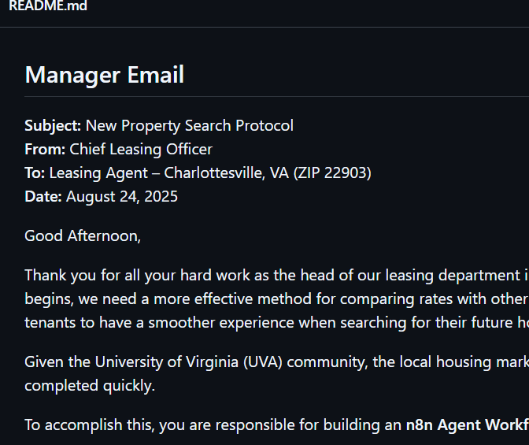

## Manager Email

**Subject:** New Property Search Protocol  
**From:** Chief Leasing Officer  
**To:** Leasing Agent – Charlottesville, VA (ZIP 22903)  
**Date:** August 24, 2025  

Good Afternoon,

Thank you for all your hard work as the head of our leasing department in Charlottesville, Virginia. Before the rush for housing begins, we need a more effective method for comparing rates with other rental properties in the area. This will allow prospective tenants to have a smoother experience when searching for their future homes!

Given the University of Virginia (UVA) community, the local housing market is already competitive, so we need this workflow completed quickly.

To accomplish this, you are responsible for building an **n8n Agent Workflow** that accepts input in the form of:

> **“X bedrooms, X bathrooms, XXXX dollars”**  
> *(representing bedroom count, bathroom count, and maximum rent)*

The goal of the workflow is to send an email (preferably via Gmail) to the user containing a list of rentals that meet the criteria listed, along with each property’s **distance to the University of Virginia’s School of Data Science** (our reference point).

### Required Workflow Components
- **Webhook** to accept the input parameters  
- **Gemini search** to gather listings and relevant information  
- **Email send** with results in **table format**  
  - If parameters are missing or unrecognizable, send an email informing the user

Good luck! We hope to see your model up and running soon as we need these listings live as soon as possible.

Thank you,  

**YS**
