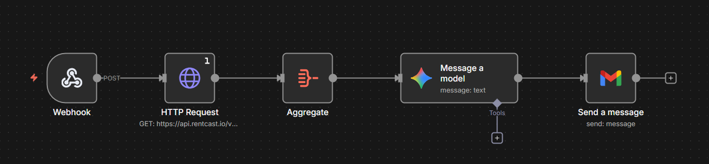
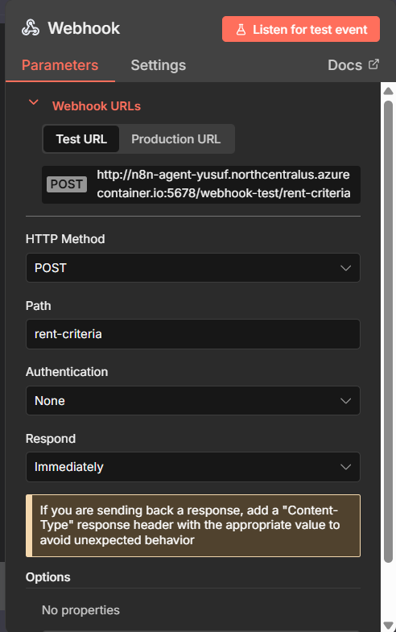
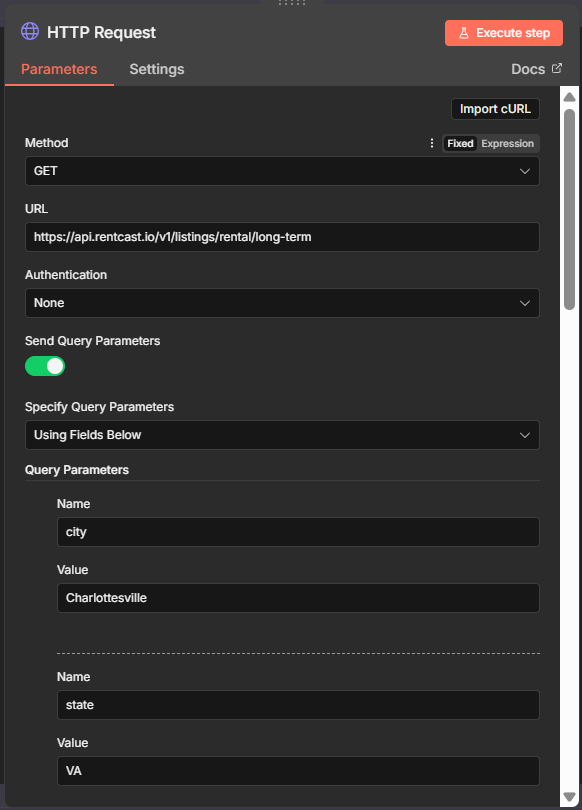
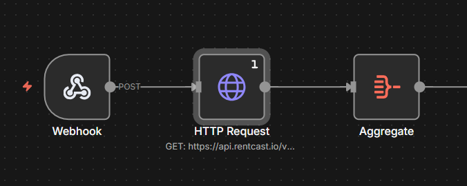
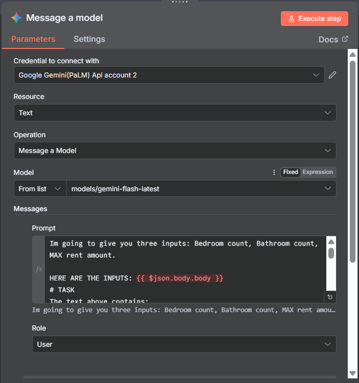
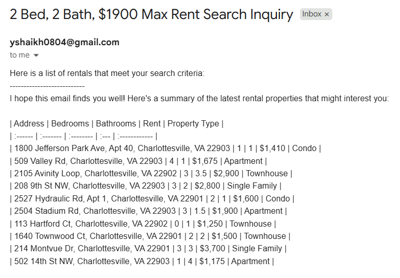
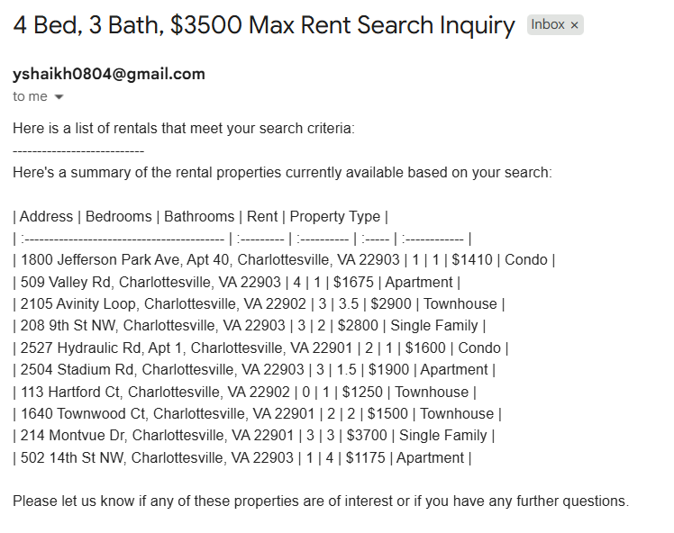

## Manager Email

**Subject:** New Property Search Protocol  
**From:** Chief Leasing Officer  
**To:** Leasing Agent – Charlottesville, VA (ZIP 22903)  
**Date:** August 24, 2025  

Good Afternoon,

Thank you for all your hard work as the head of our leasing department in Charlottesville, Virginia. Before the rush for housing begins, we need a more effective method for comparing rates with other rental properties in the area. This will allow prospective tenants to have a smoother experience when searching for their future homes!

Given the University of Virginia (UVA) community, the local housing market is already competitive, so we need this workflow completed quickly.

To accomplish this, you are responsible for building a backend **n8n Agent Workflow** that accepts input through a form:

> **“X bedrooms, X bathrooms, XXXX dollars, Email"**  
> *(representing bedroom count, bathroom count, maximum rent, and email recipient)*

The goal of the workflow is to send an email (preferably via Gmail) to the user containing a list of rentals that meet the criteria they enter in the form.

### Required Workflow Components
- **Webhook** to accept the input parameters  
- **Rental API search** to gather listings and relevant information
- **AI Formatting**
- **Email send** with results in **table format**  

Good luck! We hope to see your model up and running soon as we need these listings live as soon as possible.

Thank you,  

**YS**

# 2) Core Concepts:

What are we building? **A user input form with an n8n backend**

It is important to know what a workflow even is. A workflow is a model that completes a certain task(s) through building blocks called nodes. The model automoates these tasks through these nodes that are built off of eachother. For example, in our case, we will provide some inputs, search based on those inputs, and output something all from inputing three parameters. Think of this as a linear model, Input -> Doing something with the input -> Output. These models can be as long or as short as the task requires them to be, for our purposes, reference the model below to see the ideal representation!

# 3) How to run:

### Step 1)  

This model will be run locally through Docker. To set up, follow these commands and make sure to have Docker installed on your machine.

Create your Docker volume

    docker volume create n8n_data

Next, lets run n8n in Docker
     
    docker run -it --rm --name n8n \
    -p 5678:5678 \
    -v n8n_data:/home/node/.n8n \
    -e N8N_SECURE_COOKIE=false
    docker.n8n.io/n8nio/n8n

You can access the n8n interface here: http://localhost:5678/
### Step 2)  

Now that we have it running, its time to start building our nodes. Our model needs to begin with a webhook node in order for it to allow an HTTP POST request. 

Select the POST HTTP Method within the node and customize the Path (ex. rent-criteria). This node acts as our entry point for the entire model, without these key components, we won't be able to build off of this node.  

The configuration of the node should look similar to this:

### Step 3) 

Now its time to perform our API search. For this project, we can use RentCast's free rental property API found on their website: https://developers.rentcast.io/reference/introduction. Make sure to select a plan and save the API key once created. We can configure the node to take in the Webhook's input parameters as well (specify them beforehand with bedroom count, bathroom count, max rent, and email). Also ensure that the location matches Charlottesville, Virginia. An easy way to do all of this is to click the "import cURL" option at the top of the node and import the cURL command that RentCast provides. See the node below:

### Step 4)

To account for multiple searches being outputted, add an "aggregate" node that takes all items from the previous node and puts them into one. This will help Gemini understand how to format all listings and also make it so that only one email is sent.  

### Step 5)  

Now its time to call the LLM model in order to format our search. Add another node, this time a "Message a model" node through Google Gemini. This part will require some additional API enabling.  

The ones we need for this project are Gemini's API and Gmail's API. You can enable the specific API's that are needed here: https://console.cloud.google.com/  

Secondly, to establish an AI API key, visit https://aistudio.google.com/ , head to dashboard, and configure an API key.

Make sure to configure proper credentials for when the "Message a Model" and "Gmail" nodes request valid credentials.

Once these are enabled, now you can successfully create your Google Gemini node. Make sure the selected operation is "Message a Model". In the prompt field, add anything you like. I decided to format an email as if I was a leasing agent and told Gemini to format a nice email with the rental listings from our API search. It will format the listings into a table and provide a small introduction and closing with the listings.

Example:

    Add a friendly **opening sentence** introducing the list.
    Below is raw rental-property search output:
    {{ $json.toJsonString() }}

    Your task:
    1. Convert the results into a single **professional email**.
    2. Format the properties in a **table** with columns such as:
     - Address
     - Bedrooms
     - Bathrooms
     - Rent
     - Property Type
    4. Make sure the email is concise, easy to scan, and well-structured.

    Return ONLY the formatted email.

Here is what the inside of the node should look like:  

  

### Step 6)
Lastly, we need our Gmail node to complete the process and send an email based on the search results! As with the "Message a Model" an API needs to be enabled for this and a set of credentials need to be created. Further, permissions need to be give to Gmail in order for it to authorize email sending. Just keep all of this in mind before proceeding and circling back and forth if you get errors. Fill in the relevant fields and for the actual body of the email, we simply want everything that Gemini outputs to us. And if you remember from before, that means referencing a previous node ("Message a Model"), like so:

    Here is a list of rentals that meet your search criteria:
    ---------------------------
    {{ $json.content.parts[0].text }}

Further, if you would like to have a "Subject" line that references the webhook inputs, follow the configuration below!  

  

Double check that your workflow looks like mine!  

 

### Step 7) Cloud Deployment (of our backend, frontend creation + deployment afterwards)

Our model is now running locally but there is an extra step to go completely public, and that is to deploy it to the cloud. With a few simple commands, we can do this. Here is the one line needed to be pasted. Change the various instances to match your name and label preferences.

    az container create -g n8n-rg -n n8n-agent --image docker.n8n.io/n8nio/n8n --ports 5678 --dns-name-label n8n-agent-yusuf --os-type Linux --cpu 1 --memory 2 --environment-variables N8N_HOST=n8n-agent-                                      yusuf.northcentralus.azurecontainer.io N8N_PORT=5678 N8N_PROTOCOL=https

    
OR (in a list version)

    az container create \
    -g n8n-rg \
    -n n8n-agent \
    --image n8nio/n8n \
    --os-type Linux \
    --cpu 1 \
    --memory 2 \
    --ip-address Public \
    --ports 5678 \
    --dns-name-label n8n-agent-yusuf \
    --environment-variables \
      N8N_HOST=n8n-agent-yusuf.northcentralus.azurecontainer.io \
      N8N_PORT=5678 \
      N8N_PROTOCOL=http \
      N8N_SECURE_COOKIE=false

Doing this allows the model to be accessible publicly instead of just locally! Congratulations!  

You can access the workflow from here:  
http://n8n-agent-yusuf.northcentralus.azurecontainer.io:5678
(link may vary depending on your name/region upon azure deplorment)  

If you notice your workflow is not present, double check that you created a volume within Azure (not just Docker). This is a common issue but once its created, you'll see it!  

Now it's time to create the form that users will fill out that the workflow will run through using the parametrs.

---------------------------------------------------------------------------------------------------------------------------------
### Step 8) Frontend Creation + Deplyment
### Conclusions/Final Thoughts

As we have stated, workflows can be very complex or as simple as they need to. This project showed us that a small workflow can accomplish quite a lot and automate very important things for us. In regard to the environment overall, I encourage you to explore more with different nodes and see what kind of projects you can make! There are many different tools and automation techniques that can be done.

# 4) Design Decisions
#### Why this concept?
Out of the concepts learned, a simple n8n automation workflow made the most sense due to the rental search needing to be automated. . Other applications/pipelines could have worked, but they would have been more tedious and may have had more potential for errors.  

#### Tradeoffs/Known Limitations
Although this project is free, it comes with limitations in certain tasks that can be performed. One drawback was that there was no direct link to Zillow/Redfin for this project, therefore the rental searchability of different properities may be limited. Further, having cloud deployment is only able to be run for a certain amount of time before the $100 credit is used under the Azure for Students account. Once the credit is used, the cloud deployment is unable to continue. One last drawback is the restrictions of using Gemini for too many searches. Gemini only has a limited amount of alotted searches for their free plan, so once that is used up for the day, the model will no longer run and get stuck at the "Message a Model" node. Additionally, RentCast's API only allows for a certain amount of free uses, so this project may not be deployed on a large scale unless it is paid for.

#### Security/Privacy
Within the model, the credentials required were all stored securely in n8n's built in system. They were stored OUTSIDE of the workflow as separate entities that were used within the workflow. Secondly, for this specific project, input validation came with the previous nodes ensuring that the fields were completed and what were needed to proceed in the workflow. Lastly, no personal data was stored. When running the single command to produce the search, only generic public data is used.  

# 5) Results and Evaluation
The workflow worked as planned and outputted all the necessary information requested! Connecting the frontend to the backend was difficult in that the backend was operating on a HTTP link and when deployed, the frontend would not connect to the backend becuase it required an HTTPS backend. To work around this, I had to create an Azure function app to convert the backend to HTTPS temporarily so the frontend and backend could communicate with each other.

2 Bed 2 Bath $1900 MAX rent sample output:  

  

4 Bed 3 Bath $3500 MAX rent sample output:  

  

 
# 6) What's Next?
This model could be much more improved like any workflow, however, given the access to certain tools, we had to work with was available. The model could incorporate the use of more rental search APIs (if available) as well. Further, incorporating a better formatted email with an overall nicer organization would be ideal!
